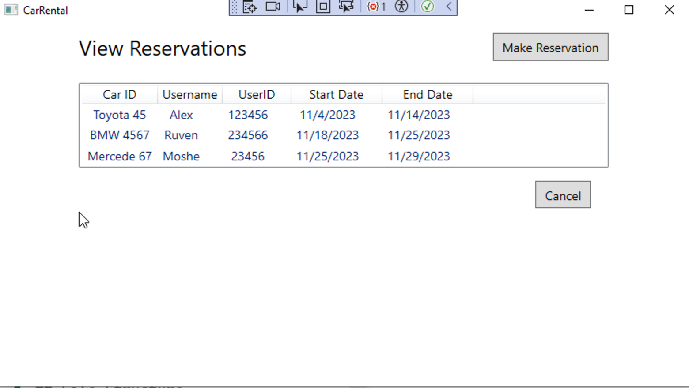

# RentCar Management Application
>created by Alexander Sychev

## Overview

This application helps manage rental cars, allowing users to add, view, and reserve cars.

## Usage

- List of all cars

You can see all the cars that exist and you can add anew car or make a reservation

- Add a new car

You need to choose a car type and color, insert a car number and press button _Add car_

- View the list of available cars and make reservation

To make a reservation you need to enter valid dats, choose a car from the list, enter the name and ID of reservating, and only then will you be able to clickon button _Reservation_.
(The list shows only those cars that were not ordered on the dates you typed)

- List of all reservations

You can see all existing reservations to know which car have been ordered on which dates.

## Dependencies

- .NET Core SDK
- Entity Framework Core

### A bit about the back code:
Project created by MVVM desing pattern. I used sqlite data base provided by EntityFrameworkCore.Sqlite to 
manage a list of cars but not to manage a list of reservations.All database
handling logic is done asynchronously. 

